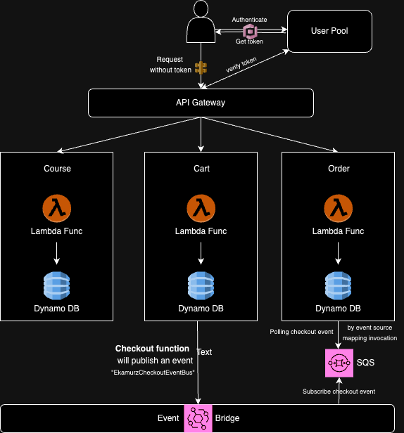

# Welcome to Ekamurz

This is a Ekamurz with Serverless Microservices.


The `cdk.json` file tells the CDK Toolkit how to execute your app.

### Run The Project
1. Clone this repository
2. At the root directory which include **cdk.json** files, run below command:
```csharp
cdk deploy
```
>Note: Make sure Docker Desktop is running before execute the cdk deploy command.

4. Wait for provision all microservices into aws cloud.

5. You can **launch microservices** as below urls:

* **Course API -> https://xxx.execute-api.us-east-2.amazonaws.com/prod/course**
* **Cart API -> https://xxx.execute-api.us-east-2.amazonaws.com/prod/cart**
* **Order API -> https://xxx.execute-api.aus-east-2.amazonaws.com/prod/order**

## Useful commands

* `npm run build`   compile typescript to js
* `npm run watch`   watch for changes and compile
* `npm run test`    perform the jest unit tests
* `cdk deploy`      deploy this stack to your default AWS account/region
* `cdk diff`        compare deployed stack with current state
* `cdk synth`       emits the synthesized CloudFormation template
